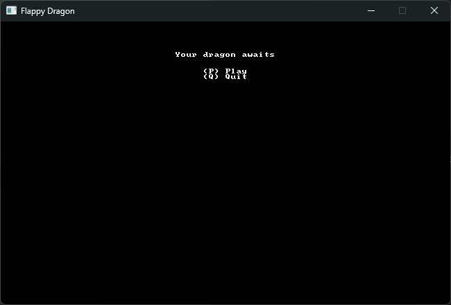
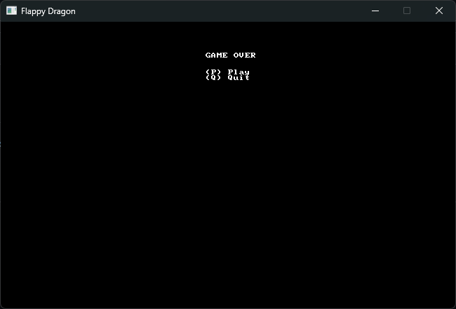

# flappy-dragon

Repo that holds the code for Hands-on Rust guided 2D Dev first game

Current State: 

Full game as in the book (with a few changes)

Want to add:

1. More than one obstacle
2. Speed up as you progess
3. Unit Tests
4. Add HighScore tracker

Demo:

https://github.com/user-attachments/assets/7d49b85c-e921-4df1-b0a4-94c2324b8e16

Main Menu:

Dead Menu:

